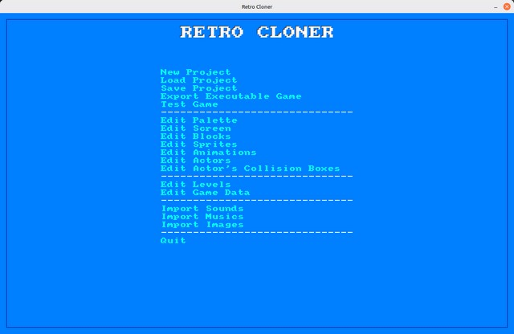
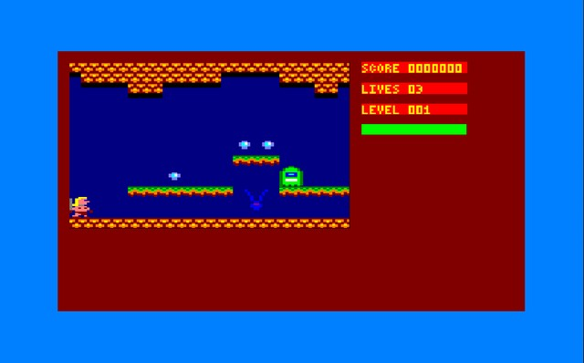
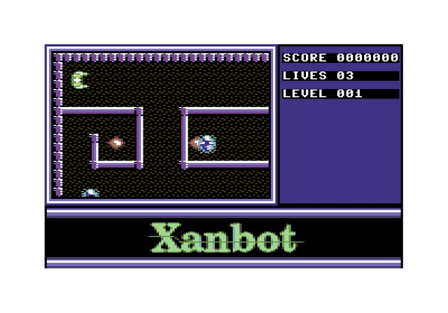

# RetroCloner

## What is RetroCloner ?

RetroCloner is a tool made with lua/löve2d to create retro games for PC easily, faking Amstrad CPC, C64 or ZX Spectrum graphics.
This project is in Work In Progress state. For now, it is developped under Linux Mint.

## Short tutorial
0) Install Löve2d 11.5, go inside RetroCloner folder, open a terminal here and type "love ."
1) Create a new project by pressing "a" key. Type a filename and choose the computer graphics preset you want.
2) Don't forget to save your project frequently, by pressing "c" key.
3) Edit your palette by pressing "f" key, if possible! A the bottom of the window, you can see the keys to edit the palette.
4) Edit the parameters of the game screen with "g" key.
5) Edit blocks with "h" key. Blocks are ground, walls, stairways and other stuffs.
6) Edit sprites images with "i" key.
7) Create animations with "j" key, choosing a few sprites images.
8) Create your actors with "k" key. You can choose what kind of game you'll play, by choosing it on actor 1. Other actors can be enemies or bonus/malus.
9) Draw your levels with "l" key. You can draw blocks, or position actors instances.
10) Edit game data with "m" key.
11) Import wav sounds with "n" key. [WIP]
12) Import ogg musics with "o" key. [WIP]
13) Import images (intro, interface, etc.) with "p" key. They will be converted to the graphic preset choosen at step 1. [WIP]
14) You can test your game with "e" key. [WIP]
15) You can export your game with "d" [WIP]

Actually, you can create a ".love" executable for Linux by copying the "game.txt" file which is inside "home/your_user_name/.local/share/love/RetroCloner/your_game_name/" into the RetroCloner player game folder. Then, like you can do with löve2d, zip the files inside the player folder, and rename the ".zip" file to ".love" file.
You need the 11.5 version of love for your game to works.
If you want to make an exe for Windows or MacOS, go to löve2d wiki, the process is explained.

### Enjoy ;)

### DjPoke
